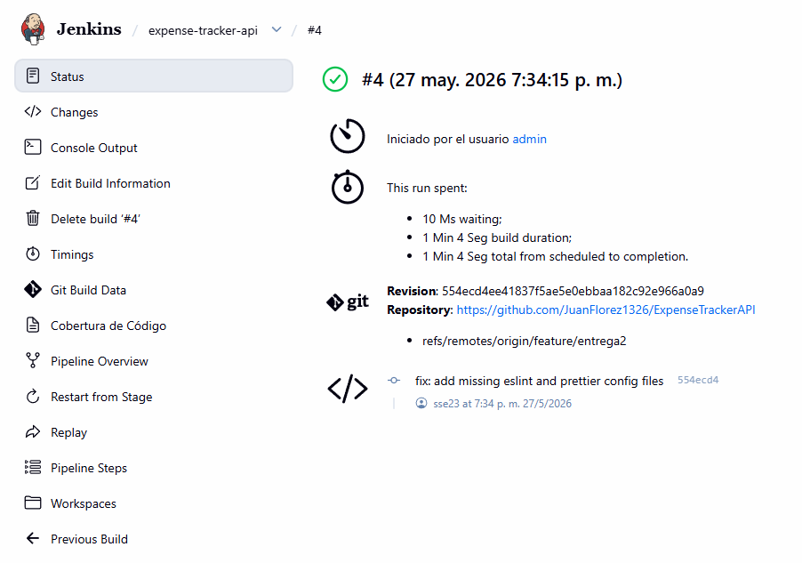
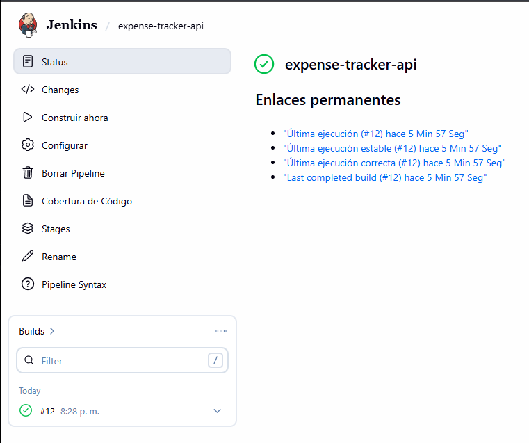
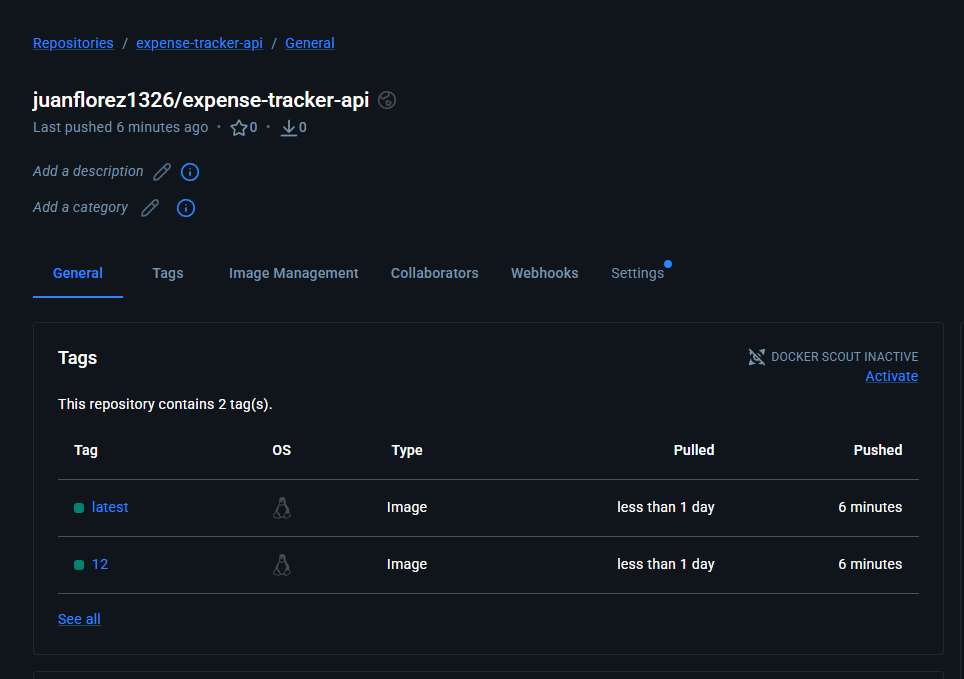
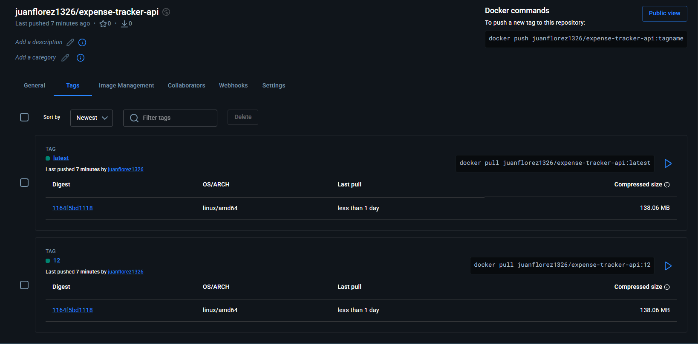

# Entrega 2 — Semana 5: Integración Continua con Jenkins

**Proyecto:** Expense Tracker API  
**Autores:** Juan Diego Aguilar Ángel · Juan Patiño Flórez · Juan Camilo Pinzón Marín · Julián Giovanny Rey Mora · Marta Teresa Velandia Urrego  
**Curso:** Integración Continua — Politécnico Grancolombiano  
**Profesor:** Jesús Figueroa Guerrero  

---

## Objetivo

Implementar Jenkins como gestor de operaciones de integración continua para el proyecto **Expense Tracker API** (NestJS + PostgreSQL + Docker), automatizando las etapas de lint, pruebas, cobertura, compilación y construcción de imagen Docker en cada push al repositorio.

---

## 1. Requisitos de infraestructura

### Hardware mínimo recomendado para el servidor Jenkins

| Recurso | Mínimo | Recomendado |
|---------|--------|-------------|
| CPU | 2 vCPU | 4 vCPU |
| RAM | 2 GB | 4 GB |
| Almacenamiento | 20 GB | 50 GB |
| Red | 100 Mbps | 1 Gbps |

> Jenkins puede correr en una VM local (VirtualBox/Hyper-V), en un contenedor Docker o en la nube (EC2, Azure VM, GCP Compute Engine).

---

## 2. Requisitos de software

| Software | Versión mínima | Propósito |
|----------|----------------|-----------|
| Jenkins | 2.440 LTS | Servidor CI |
| Java (JDK) | 17 | Runtime de Jenkins |
| Docker Engine | 24+ | Construir y ejecutar imágenes |
| Docker Compose | 2.x | Orquestación de contenedores |
| Node.js | 20 LTS | Ejecutar `npm ci`, `npm run build`, `npm run test` |
| Git | 2.x | Clonar el repositorio |

---

## 3. Plugins requeridos de Jenkins

Los siguientes plugins deben instalarse desde **Administrar Jenkins → Gestionar plugins**:

| Plugin | Función en el pipeline |
|--------|----------------------|
| **Pipeline** | Habilitar pipelines declarativos (Jenkinsfile) |
| **Git** | Integración con repositorio GitHub |
| **NodeJS Plugin** | Inyectar Node.js 20 como herramienta del agente |
| **Docker Pipeline** | Usar `docker.build()` y `docker.withRegistry()` en el pipeline |
| **HTML Publisher** | Publicar el reporte de cobertura de Jest |
| **JUnit** | Publicar resultados de pruebas en formato XML |
| **Credentials Binding** | Manejo seguro de secretos (Docker Hub, JWT Secret) |
| **GitHub Branch Source** | Detectar ramas y Pull Requests automáticamente |
| **Workspace Cleanup** | `cleanWs()` al final de cada build |

---

## 4. Configuración de herramientas en Jenkins

### 4.1 Node.js

1. Ir a **Administrar Jenkins → Tools → NodeJS installations**.
2. Agregar instalación con:
   - **Nombre:** `20` (debe coincidir con `tools { nodejs '20' }` del Jenkinsfile)
   - **Versión:** Node.js 20.x LTS
   - Marcar **Install automatically**

### 4.2 Docker

El usuario que ejecuta Jenkins (`jenkins`) debe pertenecer al grupo `docker`:

```bash
sudo usermod -aG docker jenkins
sudo systemctl restart jenkins
```

### 4.3 Credenciales

Crear las siguientes credenciales en **Administrar Jenkins → Credentials → System → Global**:

| ID de credencial | Tipo | Descripción |
|-----------------|------|-------------|
| `dockerhub-credentials` | Username with password | Usuario y token de Docker Hub (para el push en rama `main`) |
| `github-token` *(opcional)* | Secret text | Token de GitHub para evitar rate-limit en webhooks |

---

## 5. Crear el Pipeline en Jenkins

1. Clic en **Nueva tarea**.
2. Nombre: `expense-tracker-api`.
3. Tipo: **Pipeline**.
4. En **Pipeline definition** seleccionar **Pipeline script from SCM**.
5. **SCM:** Git.
6. **Repository URL:** `https://github.com/JuanFlorez1326/ExpenseTrackerAPI`
7. **Branch Specifier:** `*/main`
8. **Script Path:** `Jenkinsfile`
9. Habilitar **GitHub hook trigger for GITScm polling** para recibir webhooks.
10. Guardar y ejecutar **Build Now**.

---

## 6. Descripción del pipeline (Jenkinsfile)

El archivo [Jenkinsfile](Jenkinsfile) en la raíz del repositorio define el pipeline declarativo con las siguientes etapas:

```
Checkout → Instalar dependencias → Lint → Pruebas unitarias
       → Cobertura de código → Build → Docker Build → Docker Push*

* Solo en rama main
```

### Detalle de cada etapa

| # | Etapa | Comando | Criterio de éxito |
|---|-------|---------|-------------------|
| 1 | **Checkout** | `checkout scm` | Código clonado sin errores |
| 2 | **Instalar dependencias** | `npm ci` | `node_modules` reproducible desde `package-lock.json` |
| 3 | **Lint** | `npm run lint` | Sin errores de ESLint/Prettier |
| 4 | **Pruebas unitarias** | `npm run test -- --ci` | Todos los tests de Jest pasan (`AuthService`, `ExpensesService`, `CategoriesService`) |
| 5 | **Cobertura de código** | `npm run test:cov` | Reporte HTML publicado; umbral configurable |
| 6 | **Build** | `npm run build` | Directorio `dist/` generado por NestJS CLI |
| 7 | **Docker Build** | `docker.build(...)` | Imagen `expense-tracker-api:<buildNumber>` construida |
| 8 | **Docker Push** *(solo `main`)* | `docker push` | Imagen publicada en Docker Hub con tags `:<buildNumber>` y `:latest` |

### Post-actions

- **Siempre:** limpia el workspace (`cleanWs()`) y elimina imágenes Docker locales para liberar espacio.
- **Éxito:** mensaje de confirmación con número de build.
- **Falla:** mensaje de alerta con número de build para revisión de logs.

---

## 7. Flujo completo de CI

```
Developer  ──push──►  GitHub  ──webhook──►  Jenkins
                                                │
                                    ┌───────────▼───────────┐
                                    │  1. Checkout           │
                                    │  2. npm ci             │
                                    │  3. Lint               │
                                    │  4. Jest (unit tests)  │
                                    │  5. Jest (coverage)    │
                                    │  6. NestJS build       │
                                    │  7. Docker build       │
                                    │  8. Docker push*       │
                                    └───────────────────────┘
                                           * solo en main
```

---

## 8. Estructura de archivos agregados en esta entrega

```
entrega 1/
├── Jenkinsfile          ← Pipeline declarativo de Jenkins (8 stages)
├── Dockerfile.jenkins   ← Imagen Jenkins personalizada con Docker CLI incluido
├── .eslintrc.js         ← Configuración de ESLint (requerida por el stage Lint)
├── .prettierrc          ← Configuración de Prettier (requerida por ESLint)
├── README-DELIVERY2.md  ← Este documento
└── package-lock.json    ← Debe estar sincronizado con package.json (npm install)
```

> **Importante:** los archivos `.eslintrc.js` y `.prettierrc` deben estar commiteados en el repositorio. Si no existen, el stage **Lint** falla con `ESLint couldn't find a configuration file`. El `package-lock.json` debe estar actualizado con `npm install` antes del primer push; si está desincronizado, el stage **Instalar dependencias** falla con `npm ci` puede only install packages when your package.json and package-lock.json are in sync.

---

## 9. Guía de instalación y ejecución desde cero (Windows 11)

Jenkins no se instala directamente en el PC. Se ejecuta como un contenedor Docker, igual que la API y la base de datos de este proyecto. El único prerequisito es tener **Docker Desktop** instalado y corriendo.

> **Prerequisito del repositorio:** antes de ejecutar el pipeline por primera vez, asegurarse de que el repositorio tenga commiteados `.eslintrc.js`, `.prettierrc` y el `package-lock.json` actualizado. Si falta alguno, el pipeline fallará en los stages de Lint o Instalar dependencias.

### Paso 1 — Verificar Docker

Abrir PowerShell y ejecutar:

```powershell
docker --version
```

Si aparece `Docker version 24.x...` o superior, continuar al siguiente paso.

---

### Paso 2 — Construir imagen Jenkins con Docker CLI

La imagen oficial `jenkins/jenkins` no incluye el cliente Docker. Se usa el `Dockerfile.jenkins` del repositorio para construir una imagen personalizada que sí lo incluye:

```powershell
docker build -t jenkins-with-docker -f Dockerfile.jenkins .
```

Tarda ~2 minutos la primera vez.

---

### Paso 3 — Levantar Jenkins en Docker

```powershell
docker run -d `
  --name jenkins `
  -u root `
  -p 8080:8080 `
  -p 50000:50000 `
  -v jenkins_home:/var/jenkins_home `
  -v //var/run/docker.sock:/var/run/docker.sock `
  jenkins-with-docker
```

> El flag `-u root` es necesario en Windows para que Jenkins pueda acceder al socket de Docker. Sin él, el stage **Docker Build** falla con `permission denied` aunque el socket esté montado.

Verificar que el contenedor quedó activo:

```powershell
docker ps
```

Debe aparecer `jenkins` con estado `Up`.

---

### Paso 4 — Abrir Jenkins en el navegador

Ir a: **http://localhost:8080**

Aparece la pantalla de desbloqueo inicial. Obtener la contraseña ejecutando:

```powershell
docker exec jenkins cat /var/jenkins_home/secrets/initialAdminPassword
```

Copiar el texto que aparece, pegarlo en el navegador y hacer clic en **Continue**.

---

### Paso 5 — Instalación de plugins base

Aparecen dos opciones. Seleccionar:

> **Install suggested plugins**

Esperar ~3 minutos mientras Jenkins instala los plugins recomendados.

---

### Paso 6 — Crear usuario administrador

Completar el formulario con usuario, contraseña y correo electrónico. Hacer clic en **Save and Continue** → **Save and Finish** → **Start using Jenkins**.

> **Si se saltó este paso:** el usuario por defecto es `admin` y la contraseña es la misma clave larga del paso 3. Recuperarla con:
> ```powershell
> docker exec jenkins cat /var/jenkins_home/secrets/initialAdminPassword
> ```

---

### Paso 7 — Instalar plugins adicionales

Ir a **Administrar Jenkins → Plugins → Available plugins** e instalar los siguientes tres plugins:

| Plugin | Función |
|--------|---------|
| `NodeJS` | Permite ejecutar `npm` en el pipeline |
| `Docker Pipeline` | Permite construir imágenes Docker desde el pipeline |
| `HTML Publisher` | Publica el reporte de cobertura de Jest |

Para cada uno: buscarlo por nombre → marcar el checkbox → clic en **Install**.

Al finalizar, marcar **Restart Jenkins when installation is complete and no jobs are running**.

---

### Paso 8 — Configurar Node.js 20

1. Ir a **Administrar Jenkins → Tools**
2. Bajar hasta la sección **NodeJS installations**
3. Clic en **Add NodeJS** y completar:
   - **Name:** `20` *(debe ser exactamente `20` para coincidir con el Jenkinsfile)*
   - **Version:** seleccionar `NodeJS 20.x.x LTS` del desplegable
   - Dejar marcado **Install automatically**
4. Clic en **Save**

---

### Paso 9 — Configurar git safe.directory

Al correr Jenkins como root, git 2.35+ bloquea repositorios creados por otros usuarios. Ejecutar una sola vez:

```powershell
docker exec jenkins git config --global --add safe.directory "*"
```

---

### Paso 10 — Agregar credenciales de Docker Hub

Para que el stage **Docker Push** pueda publicar la imagen es necesario un token de Docker Hub con permisos de lectura y escritura.

**Crear el token en Docker Hub:**
1. Ir a [hub.docker.com](https://hub.docker.com) → usuario → **Account Settings → Personal access tokens**
2. Clic en **Generate new token**
3. **Description:** `jenkins-push`
4. **Access permissions:** `Read & Write` *(debe ser Read & Write, no solo Read)*
5. Copiar el token generado

**Agregar la credencial en Jenkins:**
1. Ir a **Administrar Jenkins → Credentials → System → Global → Add Credentials**
2. Completar:
   - **Kind:** `Username with password`
   - **Username:** tu usuario de Docker Hub
   - **Password:** el token copiado
   - **ID:** `dockerhub-credentials`
3. Clic en **Create**

---

### Paso 11 — Crear el pipeline

1. En el menú principal hacer clic en **Nueva tarea** (o **New Item**)
2. Escribir el nombre: `expense-tracker-api`
3. Seleccionar **Pipeline** y hacer clic en **OK**
4. En la sección **Pipeline** de la configuración:
   - **Definition:** `Pipeline script from SCM`
   - **SCM:** `Git`
   - **Repository URL:** `https://github.com/JuanFlorez1326/ExpenseTrackerAPI`
   - **Branch Specifier:** `*/feature/entrega2`
   - **Script Path:** `Jenkinsfile`
5. Hacer clic en **Save**

---

### Paso 12 — Ejecutar el pipeline y ver el resultado

1. Hacer clic en **Build Now** en el menú izquierdo
2. Aparece el build `#1` en la sección **Build History**
3. Hacer clic en `#1` → **Console Output** para ver los logs en tiempo real

Las etapas se ejecutan en orden:

```
✓ Checkout                 → código clonado desde GitHub
✓ Instalar dependencias    → npm ci
✓ Lint                     → eslint sin errores
✓ Pruebas unitarias        → 12 tests pasados (AuthService, ExpensesService, CategoriesService)
✓ Cobertura de código      → reporte HTML disponible en el menú lateral del build
✓ Build                    → dist/ generado por NestJS
✓ Docker Build             → imagen expense-tracker-api:<n> construida
✓ Docker Push              → imagen publicada en Docker Hub con tags :<n> y :latest
```

El reporte de cobertura de Jest queda disponible en la UI del build bajo el enlace **"Cobertura de Código"** en el menú lateral izquierdo de cada ejecución.

---

## 10. Evidencia de ejecución exitosa

Build **#11** ejecutado el 27 de mayo de 2026 — los 8 stages completados exitosamente sobre la rama `feature/entrega2`. Imagen publicada en Docker Hub como `juanflorez1326/expense-tracker-api:11` y `juanflorez1326/expense-tracker-api:latest`.

**Pipeline completado (stages de lint, tests, cobertura y build):**



**Stage Docker Build y Docker Push en verde:**



**Imagen publicada en Docker Hub:**




