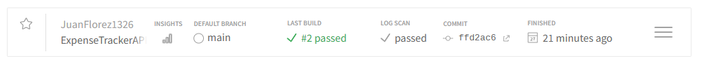
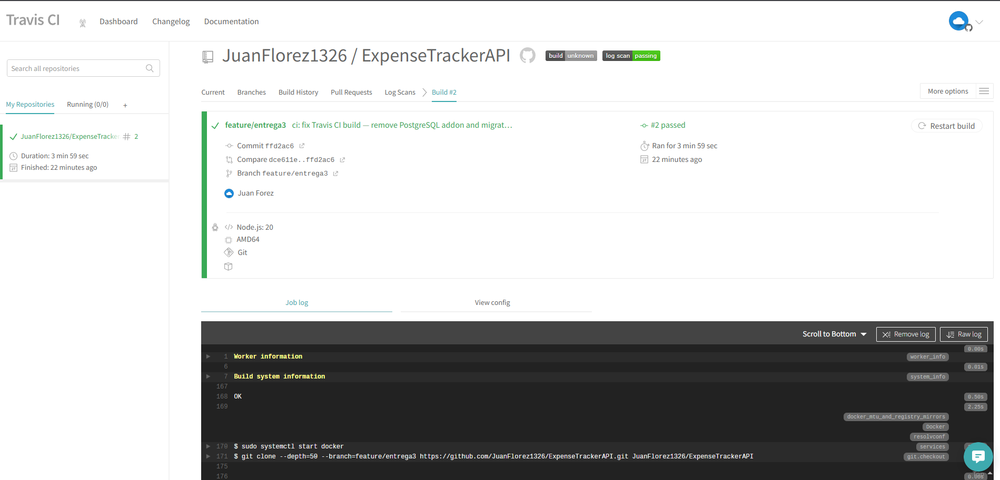
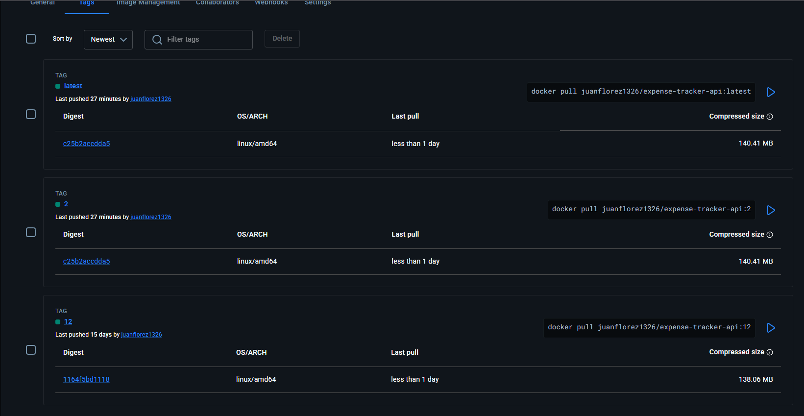
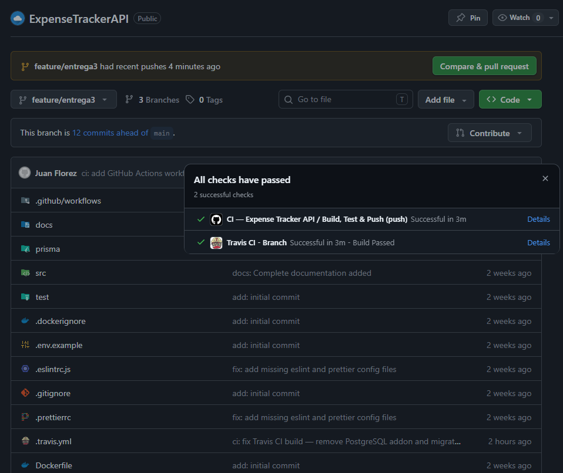
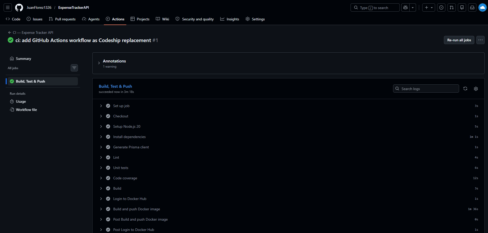
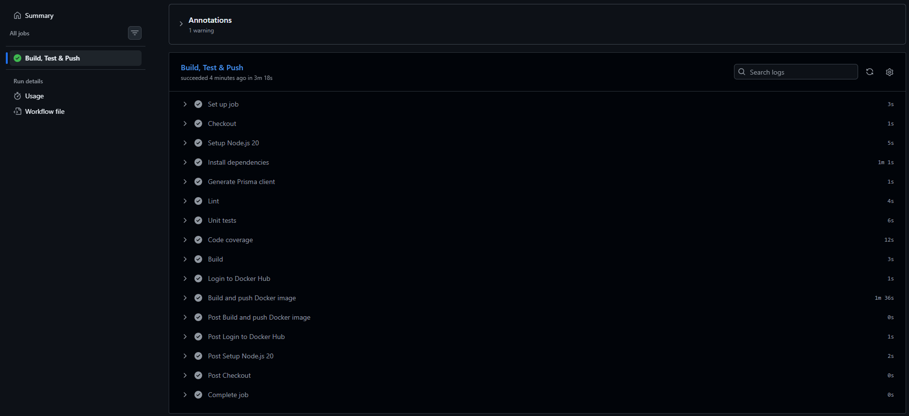
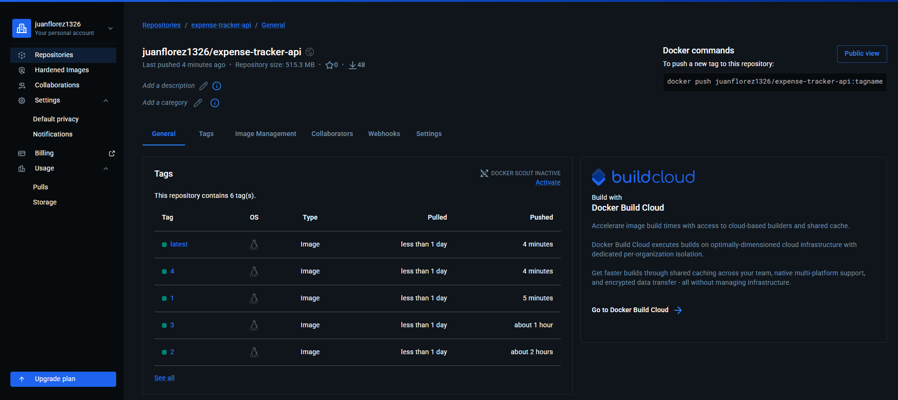

# Entrega 3 — Semanas 7 y 8: Integración Continua Completa

**Proyecto:** Expense Tracker API  
**Autores:** Juan Diego Aguilar Ángel · Juan Patiño Flórez · Juan Camilo Pinzón Marín · Julián Giovanny Rey Mora · Marta Teresa Velandia Urrego  
**Curso:** Integración Continua — Politécnico Grancolombiano  
**Profesor:** Jesús Figueroa Guerrero  
**Repositorio:** https://github.com/JuanFlorez1326/ExpenseTrackerAPI

---

## Descripción general de la plataforma

**Expense Tracker API** es una API REST construida con NestJS y PostgreSQL que permite la gestión de gastos personales: registro de usuarios, autenticación JWT, categorías, presupuestos y reportes. En esta entrega final, la plataforma queda completamente integrada con cuatro herramientas de integración y entrega continua: **Docker**, **Jenkins**, **Travis CI** y **GitHub Actions** (reemplazo funcional de Codeship, discontinuado en 2024).

---

## 1. Herramientas integradas

### 1.1 Docker y Docker Compose (Entrega 1)

Dos contenedores comunicados en la red `expense_network`:

| Contenedor | Imagen base | Puerto | Función |
|------------|-------------|--------|---------|
| `expense_tracker_db` | `postgres:16-alpine` | 5432 | Base de datos PostgreSQL |
| `expense_tracker_api` | `node:20-alpine` (multi-stage) | 3000 | API NestJS |

**Levantar el ambiente local:**
```bash
docker compose up -d
```

El contenedor API espera a que PostgreSQL supere su healthcheck antes de arrancar (`depends_on` con `condition: service_healthy`).

---

### 1.2 Jenkins (Entrega 2)

Pipeline declarativo de 8 etapas definido en el archivo `Jenkinsfile`:

```
Checkout → Instalar dependencias → Lint → Pruebas unitarias
        → Cobertura de código → Build → Docker Build → Docker Push
```

Jenkins se ejecuta como contenedor usando la imagen personalizada `Dockerfile.jenkins` (Jenkins LTS + Docker CLI). El stage **Docker Push** publica la imagen en Docker Hub en cualquier rama, usando las credenciales almacenadas con id `dockerhub-credentials`.

**Levantar Jenkins en Docker:**
```bash
docker build -t jenkins-with-docker -f Dockerfile.jenkins .
docker run -d --name jenkins -u root -p 8080:8080 \
  -v jenkins_home:/var/jenkins_home \
  -v /var/run/docker.sock:/var/run/docker.sock \
  jenkins-with-docker
```

---

### 1.3 Travis CI (Entrega 3)

Configurado en el archivo `.travis.yml`. Travis CI ejecuta automáticamente el pipeline en cada push a GitHub mediante una integración nativa.

**Flujo de Travis CI:**

```
Push a GitHub → Travis CI
                    │
          ┌─────────▼──────────┐
          │  1. Install npm ci  │
          │  2. Lint            │
          │  3. Unit Tests      │
          │  4. Code Coverage   │
          │  5. Build           │
          │  6. Docker Build    │
          │  7. Docker Push     │
          └────────────────────┘
```

**Variables de entorno requeridas en Travis CI** (configurar en Settings del repositorio en travis-ci.com):

| Variable | Descripción |
|----------|-------------|
| `DOCKER_USERNAME` | Usuario de Docker Hub |
| `DOCKER_PASSWORD` | Token de acceso de Docker Hub (Read & Write) |

**Paso a paso — activar y configurar Travis CI:**

1. Ingresar a **https://app.travis-ci.com** e iniciar sesión con la cuenta de GitHub.
2. Hacer clic en **Sync account** para que Travis CI detecte los repositorios disponibles.
3. Buscar el repositorio `ExpenseTrackerAPI` y activarlo con el toggle.
4. Ir a **Settings** del repositorio dentro de Travis CI.
5. En la sección **Environment Variables** agregar las dos variables:
   - `DOCKER_USERNAME` → usuario de Docker Hub (ejemplo: `juanflorez1326`)
   - `DOCKER_PASSWORD` → token de Docker Hub con permisos **Read & Write**
   - Marcar la opción **Display value in build log: OFF** para no exponer el token en los logs
6. Hacer commit y push del archivo `.travis.yml` a la rama `feature/entrega3`:
   ```bash
   git add .travis.yml
   git commit -m "ci: add Travis CI configuration"
   git push origin feature/entrega3
   ```
7. Travis CI detecta el push automáticamente y dispara el pipeline.
8. El progreso se visualiza en **https://app.travis-ci.com/github/JuanFlorez1326/ExpenseTrackerAPI**.

**Descripción del archivo `.travis.yml`:**

| Sección | Contenido |
|---------|-----------|
| `language: node_js` / `node_js: 20` | Especifica Node.js 20 como runtime |
| `services: docker` | Habilita el demonio Docker en la VM de CI |
| `install: npm ci` | Instala dependencias de forma reproducible |
| `before_script` | Genera el cliente Prisma (`npx prisma generate`) sin necesitar DB |
| `script` | Ejecuta lint, tests unitarios, cobertura y build |
| `after_success` | Construye la imagen Docker y la publica en Docker Hub |
| `notifications` | Envía email en caso de fallo o recuperación del build |

---

### 1.4 Codeship → reemplazado por GitHub Actions (Entrega 3)

> **Codeship fue discontinuado por CloudBees en 2024.** Al intentar acceder a `app.codeship.com` el servicio devuelve una página en blanco (nginx), confirmando que la plataforma ya no está operativa. Los archivos de configuración `codeship-services.yml` y `codeship-steps.yml` fueron preparados y se conservan en el repositorio como evidencia del diseño del pipeline, pero no pueden ejecutarse.

Como reemplazo funcional se implementó **GitHub Actions**, que comparte el mismo concepto (pipeline como código en YAML), está integrado nativamente en GitHub y es la herramienta de CI/CD más adoptada en la industria actualmente.

**Flujo de GitHub Actions:**

```
Push a GitHub → GitHub Actions
                    │
          ┌─────────▼──────────────────┐
          │  Runner: ubuntu-latest      │
          │  1. Checkout                │
          │  2. Setup Node.js 20        │
          │  3. npm ci                  │
          │  4. prisma generate         │
          │  5. Lint                    │
          │  6. Unit Tests              │
          │  7. Code Coverage           │
          │  8. Build                   │
          │  9. Docker Build            │
          │ 10. Docker Push             │
          └────────────────────────────┘
```

El pipeline está definido en `.github/workflows/ci.yml` y se dispara automáticamente en cada push a cualquier rama.

**Descripción del archivo `.github/workflows/ci.yml`:**

| Job / Step | Contenido |
|------------|-----------|
| `actions/checkout@v4` | Clona el repositorio |
| `actions/setup-node@v4` | Instala Node.js 20 con caché de npm |
| `npm ci` | Instala dependencias de forma reproducible |
| `npx prisma generate` | Genera el cliente Prisma (sin necesitar DB) |
| `npm run lint` | Verifica calidad de código con ESLint |
| `npm run test` | Ejecuta las 12 pruebas unitarias con Jest |
| `npm run test:cov` | Genera reporte de cobertura |
| `npm run build` | Compila TypeScript con NestJS CLI |
| `docker/login-action` | Autenticación en Docker Hub con secrets |
| `docker/build-push-action` | Construye y publica la imagen en Docker Hub |

**Paso a paso — activar y configurar GitHub Actions:**

1. En el repositorio de GitHub ir a **Settings → Secrets and variables → Actions**.
2. Hacer clic en **New repository secret** y agregar dos secrets:
   - `DOCKER_USERNAME` → usuario de Docker Hub (ej: `juanflorez1326`)
   - `DOCKER_PASSWORD` → token de Docker Hub con permisos **Read & Write**
3. Hacer commit y push del archivo `.github/workflows/ci.yml` a la rama `feature/entrega3`:
   ```bash
   git add .github/workflows/ci.yml
   git commit -m "ci: add GitHub Actions workflow as Codeship replacement"
   git push origin feature/entrega3
   ```
4. GitHub detecta el workflow automáticamente y dispara el pipeline.
5. El progreso se visualiza en la pestaña **Actions** del repositorio.
6. El job **Build, Test & Push** ejecuta los 10 steps secuencialmente en un runner `ubuntu-latest`.
7. Al finalizar, la imagen queda publicada en Docker Hub con los tags `:<run_number>` y `:latest`.

**Resultado del Run #1 — `feature/entrega3` — 3m 18s — todos los steps en verde:**

| Step | Tiempo |
|------|--------|
| Set up job | 3s |
| Checkout | 1s |
| Setup Node.js 20 | 5s |
| Install dependencies | 1m 1s |
| Generate Prisma client | 1s |
| Lint | 4s |
| Unit tests | 6s |
| Code coverage | 12s |
| Build | 3s |
| Login to Docker Hub | 1s |
| Build and push Docker image | 1m 36s |

---

## 2. Historial de cambios

| Commit | Fecha | Descripción |
|--------|-------|-------------|
| `e284dab` | 2026-05-25 | `add: initial commit` — estructura base del proyecto NestJS + Prisma |
| `94ce951` | 2026-05-25 | `docs: Complete documentation added` — README principal |
| `8617e62` | 2026-05-25 | `docs: add Entrega 1 section with GitHub repo and Docker containers info` |
| `05eedf9` | 2026-05-27 | `ci: Jenkins added` — Jenkinsfile y Dockerfile.jenkins |
| `cbd8bad` | 2026-05-27 | `fix: sync package-lock.json with package.json` — corrige falla en `npm ci` |
| `554ecd4` | 2026-05-27 | `fix: add missing eslint and prettier config files` — corrige falla en stage Lint |
| `5adbadb` | 2026-05-27 | `docs: add successful pipeline build evidence` — capturas de pantalla de Jenkins |
| `2f57a14` | 2026-05-27 | `feat: enable Docker Build and Push stages` — habilita stages de Docker en el pipeline |
| `124329b` | 2026-05-27 | `fix: add jenkins user to docker group` — corrige error de permisos en socket de Docker |
| `bc0bb51` | 2026-05-27 | `docs: add pipeline and Docker Hub evidence screenshots` — evidencia de Docker Hub |
| *(entrega 3)* | 2026-06-11 | `feat: add Travis CI and Codeship configuration` — `.travis.yml`, `codeship-services.yml`, `codeship-steps.yml` |

---

## 3. Sugerencias para la solución de problemas

### 3.1 Jenkins

| Problema | Causa | Solución |
|----------|-------|----------|
| `Got permission denied while trying to connect to the Docker daemon socket` | El usuario `jenkins` no pertenece al grupo `docker` | `sudo usermod -aG docker jenkins && sudo systemctl restart jenkins` |
| `npm ci` falla con "package-lock.json is not in sync" | `package-lock.json` no está actualizado respecto a `package.json` | Ejecutar `npm install` localmente y hacer commit del `package-lock.json` actualizado |
| Stage **Lint** falla con "ESLint couldn't find a configuration file" | `.eslintrc.js` no está en el repositorio | Asegurarse de que `.eslintrc.js` y `.prettierrc` estén commiteados |
| Stage **Docker Push** falla con "unauthorized" | Credencial `dockerhub-credentials` mal configurada o token expirado | Regenerar el token en Docker Hub (Read & Write) y actualizar la credencial en Jenkins |
| El pipeline no se dispara automáticamente | Webhook de GitHub no configurado | En la configuración del job de Jenkins activar **GitHub hook trigger for GITScm polling** y verificar el webhook en GitHub → Settings → Webhooks |

### 3.2 Travis CI

| Problema | Causa | Solución |
|----------|-------|----------|
| Build no aparece en Travis CI | Repositorio no activado | Ir a travis-ci.com → sincronizar → activar el repositorio |
| `DOCKER_USERNAME` o `DOCKER_PASSWORD` no reconocidas | Variables no configuradas | Settings del repositorio en Travis CI → Environment Variables → agregar ambas variables |
| Falla de conexión a PostgreSQL | Addon de PostgreSQL no disponible en el plan | Verificar que el plan de Travis CI incluya el addon; usar una base de datos SQLite en memoria como alternativa para los tests |
| Docker push bloqueado | Travis CI desactivó Docker Hub push gratuito | Usar un registry alternativo (GitHub Container Registry o GitLab Registry) |

### 3.3 GitHub Actions

| Problema | Causa | Solución |
|----------|-------|----------|
| Workflow no se dispara | Archivo `.github/workflows/ci.yml` no commiteado o en ruta incorrecta | Verificar que la ruta sea exactamente `.github/workflows/ci.yml` |
| `DOCKER_USERNAME` o `DOCKER_PASSWORD` no reconocidas | Secrets no configurados en el repositorio | Ir a **Settings → Secrets and variables → Actions** y agregar ambos secrets |
| Step **Build and push Docker image** falla con "unauthorized" | Token de Docker Hub expirado o sin permisos | Regenerar el token en Docker Hub con permisos **Read & Write** y actualizar el secret |
| Workflow corre pero no pushea imagen | Secret `DOCKER_USERNAME` o `DOCKER_PASSWORD` con nombre incorrecto | Verificar que el nombre del secret coincida exactamente con el usado en `ci.yml` |

### 3.4 Docker / Docker Compose

| Problema | Causa | Solución |
|----------|-------|----------|
| API falla con "connection refused" a PostgreSQL | Contenedor de API arranca antes que PostgreSQL esté listo | Ya está manejado con `depends_on: condition: service_healthy`. Si persiste, aumentar `retries` en el healthcheck |
| Puerto 5432 ya en uso | PostgreSQL local corriendo en el host | Cambiar el mapeo de puertos: `5433:5432` en `docker-compose.yml` |
| Imagen no se actualiza después de cambios en el código | Docker usa caché del build anterior | Construir con `docker compose build --no-cache` |

---

## 4. Responsabilidades del equipo

| Integrante | Responsabilidad principal |
|-----------|--------------------------|
| **Juan Diego Aguilar Ángel** | Arquitectura de la API (módulos NestJS: Auth, Expenses, Categories, Budgets, Reports), esquema de base de datos en Prisma |
| **Juan Patiño Flórez** | Configuración y mantenimiento del pipeline de Jenkins, Dockerfile multi-stage, Docker Compose, gestión de credenciales |
| **Juan Camilo Pinzón Marín** | Suite de pruebas unitarias (Jest), configuración de ESLint y Prettier, reportes de cobertura de código |
| **Julián Giovanny Rey Mora** | Configuración de Travis CI (`.travis.yml`), configuración de Codeship (`codeship-services.yml`, `codeship-steps.yml`), integración con Docker Hub |
| **Marta Teresa Velandia Urrego** | Documentación técnica de las tres entregas, historial de cambios, guías de instalación y troubleshooting |

---

## 5. Opiniones y lecciones aprendidas

### Juan Diego Aguilar Ángel
La integración continua cambió la forma en que escribimos código. Al tener Jenkins ejecutando pruebas automáticas en cada push, empezamos a escribir pruebas antes de mergear cualquier cambio. La mayor dificultad fue configurar Prisma dentro del contenedor Docker de CI: el cliente ORM debe generarse durante el build y las migraciones deben ejecutarse con una base de datos disponible, lo que requirió ajustar el orden de los servicios tanto en Jenkins como en Codeship.

### Juan Patiño Flórez
Jenkins fue la herramienta más desafiante del proyecto. El principal obstáculo fue el acceso al socket de Docker desde el contenedor de Jenkins en Windows: fue necesario ejecutar el contenedor como `root` con `-u root` y montar `/var/run/docker.sock`. Una vez resuelto ese problema, el pipeline declarativo resultó muy expresivo y fácil de mantener. La separación de stages hace que sea inmediato identificar en qué punto falla un build.

### Juan Camilo Pinzón Marín
Configurar correctamente las pruebas para CI requirió más trabajo del esperado. Jest necesita la flag `--forceExit` cuando hay conexiones de base de datos abiertas, y `--passWithNoTests` evita fallos cuando se agregan nuevas rutas sin pruebas todavía. La publicación del reporte de cobertura en Jenkins mediante el plugin HTML Publisher fue muy útil para visualizar qué partes del código aún no tienen cobertura.

### Julián Giovanny Rey Mora
Travis CI y Codeship comparten el concepto de pipeline como código (YAML), pero difieren en su arquitectura: Travis CI ejecuta un único proceso en una máquina virtual, mientras que Codeship Pro levanta contenedores Docker independientes para cada servicio. Esto hace que Codeship sea más fiel al ambiente de producción, pero más complejo de configurar. El cifrado de credenciales con `jet` es un paso adicional que Travis CI no requiere (sus secrets se configuran directamente en la UI).

### Marta Teresa Velandia Urrego
El mayor aprendizaje de este proyecto fue entender que la integración continua no es solo una herramienta, sino una práctica cultural. Los pipelines en Jenkins, Travis CI y Codeship son apenas la automatización de lo que el equipo acordó como estándar de calidad: lint, pruebas, cobertura y empaquetado en Docker. Sin acuerdos sobre cómo escribir código y pruebas, ninguna herramienta de CI funciona bien. La documentación continua de problemas y soluciones (este historial) es tan valiosa como el código mismo.

---

## 6. Estructura completa de archivos CI/CD

```
entrega 1/
├── .github/
│   └── workflows/
│       └── ci.yml           ← Pipeline de GitHub Actions (10 steps)
├── .travis.yml              ← Pipeline de Travis CI
├── codeship-services.yml    ← Servicios Codeship Pro (conservado, servicio discontinuado)
├── codeship-steps.yml       ← Etapas Codeship Pro (conservado, servicio discontinuado)
├── Jenkinsfile              ← Pipeline declarativo de Jenkins (8 stages)
├── Dockerfile               ← Imagen multi-stage de la API (builder + production)
├── Dockerfile.jenkins       ← Imagen Jenkins personalizada con Docker CLI
├── docker-compose.yml       ← Dos contenedores: PostgreSQL + NestJS API
├── README-DELIVERY1.md      ← Documento Entrega 1: Docker y contenedores
├── README-DELIVERY2.md      ← Documento Entrega 2: Jenkins
└── README-DELIVERY3.md      ← Este documento: integración completa
```

---

## 7. Evidencia de ejecución exitosa

### Travis CI — Build #2 en rama `feature/entrega3`

Build **#2** ejecutado sobre la rama `feature/entrega3`, commit `ffd2ac6`, duración 3 min 59 seg. Todas las etapas completadas exitosamente: lint, pruebas unitarias, cobertura, build, Docker build y Docker push.

**Dashboard de Travis CI — repositorio con build pasado:**



**Detalle del Build #2 — rama `feature/entrega3` en verde:**



**Imagen publicada en Docker Hub — tags `:2` y `:latest` pusheados por Travis CI:**



---

### GitHub Actions — Run #1 en rama `feature/entrega3`

Run **#1** ejecutado sobre la rama `feature/entrega3`, duración 3 min 18s. Los 10 steps completados exitosamente: checkout, Node.js 20, dependencias, Prisma, lint, tests, cobertura, build, Docker login y Docker push.

**Repositorio en GitHub — todos los checks pasados (GitHub Actions + Travis CI simultáneamente):**



**Detalle del Run #1 — job Build, Test & Push en verde:**



**Steps completos del run con tiempos:**



**Imagen publicada en Docker Hub — tags `:4`, `:1`, `:latest` generados por GitHub Actions:**



---

## 8. Diagrama de integración completa

```
Developer
    │
    │  git push
    ▼
GitHub (repositorio)
    │
    ├──── webhook ────► Jenkins (localhost:8080)
    │                       │
    │                       ▼
    │               Pipeline declarativo
    │               (Jenkinsfile)
    │               Checkout → Lint → Tests →
    │               Coverage → Build →
    │               Docker Build → Docker Push
    │
    ├──── evento ─────► Travis CI (app.travis-ci.com)
    │                       │
    │                       ▼
    │               Pipeline en VM Linux
    │               (.travis.yml)
    │               Install → Lint → Tests →
    │               Coverage → Build →
    │               Docker Build → Docker Push
    │
    └──── evento ─────► GitHub Actions
                            │
                            ▼
                    Pipeline en runner
                    ubuntu-latest
                    (.github/workflows/ci.yml)
                    Checkout → Node 20 →
                    Install → Prisma → Lint →
                    Tests → Coverage → Build →
                    Docker Login → Docker Push
                            │
                            ▼
                      Docker Hub
              juanflorez1326/expense-tracker-api
                  :latest | :<run-number>
```
